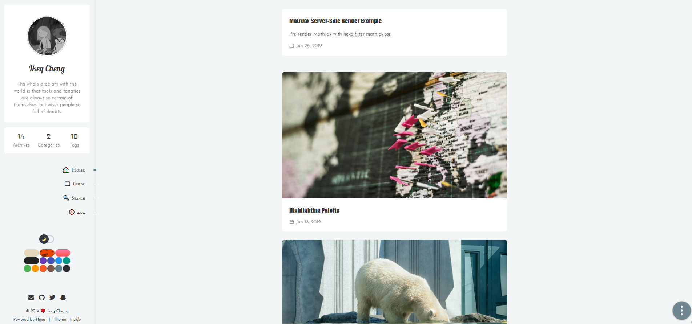

# Tbaglee's Blog

🎉🎉🎉  欢迎您访问我的博客：[https://tbaglee.top](https://tbaglee.top)

### 本站信息

- 框架主题：[Hexo 5.3.0](https://hexo.io/) + [inside 2.7.0-beta.8](https://github.com/ikeq/hexo-theme-inside)
- 托管服务：[GitHub Pages](https://pages.github.com)
- 评论系统：[Valine](https://valine.js.org)
- 持续集成：[Travis CI](https://travis-ci.org)
- 统计服务：[LeanCloud](https://www.leancloud.cn)、[不蒜子](http://busuanzi.ibruce.info)

### 核心文件

本站生成的核心为站点配置文件(_config.yml)和主题配置文件(/themes/inside/_config.yml)

```
.
├── _config.yml
└── themes
    └── inside
        └── _config.yml
```

### 编辑工具

- `Visual Studio Code`

### 效果图



### 注

- 访问地址：[个人博客](https://tbaglee.top/)

### 更新时间

>2021-1-13

### 主题拓展

💡 不定期更新博文，如果你需要我帮忙拓展实现某些自定义的功能，也可以在博客评论区或者 issue 中提出。

这篇总结要是对你有帮助，请给个 Star✨ 鼓励一下～
